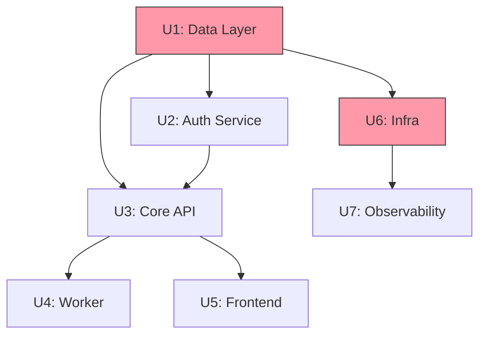

# Blueprint Skill

> Think at the project level before thinking at the task level.

## When to Use This Skill

Use Blueprint when the project requires:
- **>3 pull requests** to complete (multiple milestones)
- **>5 subsystems** (frontend + backend + worker + infra + data pipeline + ...)
- **Multiple sessions** (project spans days or weeks)
- **Multiple team members** (or multiple parallel agent streams)
- **Complex dependencies** (step B cannot start until step A ships to production)

For single-PR features, use `spec-driven-dev` + `planner` directly.

---

## Blueprint vs Plan

| Dimension | PLAN.md | BLUEPRINT.md |
|-----------|---------|-------------|
| Scope | One PR, one feature | Whole project, many PRs |
| Steps | Tasks (hours) | Phases (days/weeks) |
| Executor | Builder subagent | Orchestrator + planner |
| State | Within one session | Across sessions |
| Output | Runnable task list | Dependency graph + context briefs |
| Mutation | Rare | Expected (plans change) |

---

## The Blueprint Protocol (6 Steps)

### Step 1: Project Decomposition

Decompose the project into **independent deliverable units**. Each unit will become one or more PRs.

```markdown
## Project: [Name]
**Goal**: [What the completed project achieves]
**Scale**: [Users, QPS, data volume, timeline]
**Stack**: [Languages, frameworks, infrastructure]

## Deliverable Units

| ID | Name | Description | PRs Est. |
|----|------|-------------|----------|
| U1 | Data Layer | PostgreSQL schema + migrations | 1 |
| U2 | Auth Service | JWT + RBAC | 1-2 |
| U3 | Core API | CRUD endpoints | 2-3 |
| U4 | Worker | Background jobs, Kafka consumer | 1 |
| U5 | Frontend | Next.js UI | 3-4 |
| U6 | Infra | Docker Compose, K8s, CI/CD | 2 |
| U7 | Observability | Metrics, logs, traces | 1 |
```

---

### Step 2: Dependency Graph

Map which units block which others. This determines execution order and parallelism.



**Parallel opportunities** (units with no blocking dependency between them):
- U1 and U6 can start simultaneously
- U4 and U5 can start simultaneously (both depend only on U3)

**Critical path**: U1 → U2 → U3 → U5 (longest chain — this determines minimum calendar time)

---

### Step 3: Cold-Start-Safe Context Briefs

Every step in the blueprint must include a **context brief** — enough information that a fresh agent (or a human returning after a week) can pick it up without reading the entire project history.

**Context Brief Template:**

```markdown
## Step [ID]: [Name]
**Status**: pending | in_progress | complete | blocked

### What This Step Delivers
[1-3 sentences: what exists after this step that didn't before]

### Context Brief (Cold-Start Safe)
**Project**: [name and one-sentence description]
**Stack**: [relevant stack for this step]
**Depends on**: [Step IDs that must be complete]
**Key decisions made upstream**: [ADRs, schema choices, API contracts that affect this step]
**Files created/modified upstream**: [paths, brief description]

### Entry Criteria
- [ ] [Step X] is complete and merged to main
- [ ] [Specific artifact exists — e.g., "migrations/001_users.sql committed"]

### Deliverables
- [ ] [Specific artifact 1]
- [ ] [Specific artifact 2]
- [ ] All tests green
- [ ] PR merged to main

### PLAN.md Pointer
When starting this step: spawn `planner` with this context brief.
Output: `PLAN-[id]-[name].md`
```

---

### Step 4: Adversarial Review Gate

Before any implementation begins on the project, the blueprint undergoes an adversarial review.

**The reviewer's job is to find every way the blueprint can fail.** Not to approve it.

**Adversarial Review Checklist:**

```
Dependency correctness:
  □ Are all dependency arrows correct? (A→B means B cannot start before A is done)
  □ Are there circular dependencies?
  □ Are there implicit dependencies not captured in the graph?

Completeness:
  □ Is every subsystem in the project represented?
  □ Are there missing units (auth, error handling, observability, data migrations)?
  □ Are the success criteria for each unit measurable?

Scope realism:
  □ Is any single unit too large? (>5 PRs = split it)
  □ Are there hidden complexity bombs? (auth, file uploads, real-time, search)
  □ Are 3rd-party integrations accounted for?

Context brief quality:
  □ Can a fresh agent execute each step using only its context brief?
  □ Are API contracts captured before implementation steps that consume them?
  □ Are schema decisions captured before application code that depends on schema?

Risk identification:
  □ What is the highest-risk step? Does it have a mitigation?
  □ What happens if [critical dependency service] is unavailable?
  □ What is the rollback plan if a step goes wrong after merge?
```

**Adversarial review is performed by the strongest available model (Opus).** The reviewer must produce a written findings list. Blueprint is not approved until all blockers are resolved.

---

### Step 5: BLUEPRINT.md Format

Write `BLUEPRINT.md` to the project root:

```markdown
# BLUEPRINT: [Project Name]
**Date**: [date]
**Status**: approved | in_progress | [N/M steps complete]
**Adversarial review**: [reviewer model] — [date] — [findings resolved]

## Project Goal
[One paragraph: what this project delivers and why]

## Architecture Overview

[C4 L1 diagram]

## Dependency Graph

[Mermaid graph from Step 2]

**Critical path**: [U1 → ... → UN — N calendar units]
**Parallel opportunities**: [list]

## Steps

### Step 1: [Name]
**Status**: pending
**Estimated PRs**: N
**Depends on**: None / Step X
[Full context brief from Step 3]

### Step 2: [Name]
**Status**: pending
**Estimated PRs**: N
**Depends on**: Step 1
[Full context brief]

[... all steps ...]

## Execution Rules
- Never start a step before its entry criteria are met
- Always create a PLAN.md for each step (spawn planner with step's context brief)
- Always merge step's PRs before marking step complete
- Update BLUEPRINT.md status after each step completes

## Plan Index
| Step | PLAN.md | Status |
|------|---------|--------|
| Step 1 | PLAN-1-[name].md | pending |
| Step 2 | PLAN-2-[name].md | pending |
| ... | ... | ... |
```

---

### Step 6: Plan Mutation Protocol

Projects change. Requirements shift. The blueprint must support controlled mutation without losing coherence.

**Mutation Types:**

| Mutation | When | Protocol |
|----------|------|----------|
| **Split** | Step is too large | Split into Step Na + Step Nb. Update all downstream context briefs. |
| **Insert** | New requirement discovered | Insert new step, update dependency graph, re-run adversarial review on affected steps. |
| **Skip** | Step no longer needed | Mark as `skipped (reason)`. Update downstream steps that depended on it. |
| **Reorder** | Priority shifted | Only valid if no dependency violation. Update graph. |
| **Abandon** | Project cancelled | Archive BLUEPRINT.md with final status + reason. |

**Mutation Rule:** Every mutation that affects a downstream step requires updating that step's context brief. A stale context brief is a lie.

**Mutation Log Format** (append to BLUEPRINT.md):

```markdown
## Mutation Log

### [date] — Split: Step 3 → Step 3a + Step 3b
**Reason**: Core API scope too large — auth endpoints separated from data endpoints
**Impact**: Steps 4, 5 now depend on 3b instead of 3
**Context briefs updated**: Steps 4, 5
```

---

## Blueprint Worked Example

**Project**: Real-time collaborative document editor

**Decomposition:**
```
U1: Data Layer — PostgreSQL schema (documents, users, operations)
U2: Auth — JWT + WebSocket auth tokens
U3: Sync Engine — CRDT operations, conflict resolution (backend)
U4: API — REST for documents CRUD + WebSocket for live sync
U5: Worker — Operation log compaction, periodic snapshots
U6: Frontend — Next.js editor with Yjs CRDT client
U7: Infra — Docker Compose, K8s, Redis, Kafka
U8: Observability — Metrics, traces, alerts
```

**Dependency graph:**
```
U1 → U2 → U4
U1 → U3 → U4
U4 → U5
U4 → U6
U7 (parallel with U1-U3)
U8 (parallel with U5-U6)
```

**Parallel opportunities:**
- U7 starts day 1 alongside U1
- U5 and U6 start simultaneously after U4
- U8 starts during U5/U6

**Critical path:** U1 → U3 → U4 → U6 (longest chain)

**Adversarial findings:**
- ⚠️ WebSocket auth is non-trivial — split U2 into U2a (REST JWT) + U2b (WebSocket token exchange)
- ⚠️ CRDT library choice must be decided before U3 starts — add ADR-001 to U3 entry criteria
- ⚠️ U6 depends on U4's WebSocket API contract — add API contract to U4 deliverables

---

## Quick Reference

```
Use Blueprint when:  >3 PRs or >5 subsystems
Output:              BLUEPRINT.md in project root
Then for each step:  PLAN-N-name.md via planner agent
Review gate:         Adversarial review by Opus before any implementation
Mutation:            Log every change, update downstream context briefs
```
