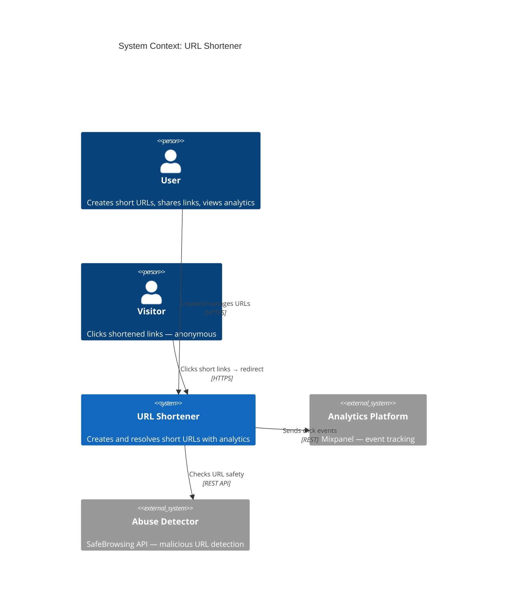
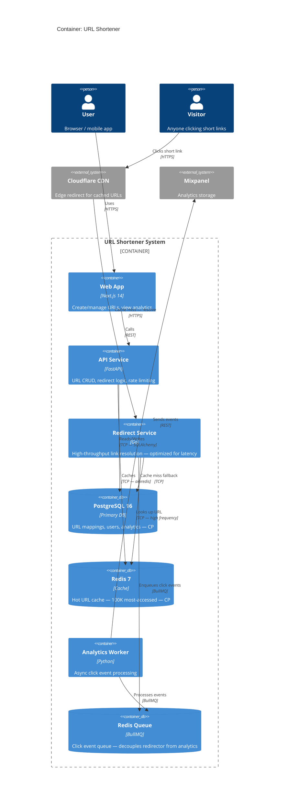

# System Design Skill

> Think before you build. Design before you code. State your trade-offs.

## The 8-Step Design Protocol

**Never skip a step. Never reorder them. Design is sequential.**

---

### Step 1: Requirements Clarification (NEVER SKIP)

Always answer both before proceeding:

**Functional Requirements:**
- What does it do? (core user flows, not implementation)
- Who uses it? (users, admins, external systems, other services)
- What are the write operations? (create, update, delete)
- What are the read operations? (search, retrieve, list)
- What are the real-time requirements? (notifications, live updates)

**Non-Functional Requirements:**
- **Scale**: QPS (queries per second), DAU (daily active users), data volume (GB/TB)
- **Latency SLA**: p50 / p95 / p99 targets (e.g., "p99 < 200ms for API, < 3s for reports")
- **Availability SLA**: 99.9% (8.7h downtime/year), 99.99% (52min/year), 99.999% (5min/year)
- **Consistency**: strong vs eventual — what happens when a user writes then immediately reads?
- **Geographic distribution**: single region, multi-region, global?
- **Read/write ratio**: 10:1? 100:1? Affects caching and DB replica strategy.

---

### Step 2: Capacity Estimation

```
Read QPS:     [DAU × actions_per_day × read_fraction] / 86400
Write QPS:    [DAU × actions_per_day × write_fraction] / 86400
Storage:      [objects × object_size_bytes] → GB/TB
Bandwidth:    [QPS × avg_response_size_bytes] → MB/s → Gbps
Cache size:   [hot_data_fraction × total_data_size] (80/20 rule: 20% of data = 80% of reads)
```

**Example — URL Shortener:**
```
DAU: 100M users
Writes: 1 URL/user/day → 100M writes/day → 1,157 write QPS
Reads: 100 reads/user/day → 10B reads/day → 115,741 read QPS → read:write = 100:1
URL size: ~500 bytes
Storage: 100M URLs × 500B = 50GB/year → trivial
Bandwidth: 115,741 QPS × 500B = ~55 MB/s → trivial
Cache: 20% of URLs = 80% of reads → cache 10M URLs = ~5GB → fits in memory
Conclusion: Read-heavy, latency-critical, cache is key, storage is not a concern.
```

---

### Step 3: C4 Level 1 — System Context Diagram

**Always produce this FIRST.** Defines system boundaries.



---

### Step 4: C4 Level 2 — Container Diagram

**Always produce this after Step 3.**



---

### Step 5: Database Design (CAP Statement Required)

**Always state the CAP trade-off before choosing a database.**

**CAP Statement for URL Shortener:**
```
URLs table: CP (PostgreSQL) — URLs must be consistent: two reads of the same
short code must return the same destination. Under partition: briefly unavailable
is acceptable; serving wrong destination is not.

Click cache: AP (Redis) — eventual consistency acceptable. Under partition:
cached URLs may be stale but redirect still works. Acceptable trade-off.
```

**Schema:**
```sql
-- URLs table
CREATE TABLE urls (
    id          UUID PRIMARY KEY DEFAULT gen_random_uuid(),
    short_code  VARCHAR(8) NOT NULL UNIQUE,
    long_url    TEXT NOT NULL,
    user_id     UUID REFERENCES users(id),
    is_active   BOOLEAN NOT NULL DEFAULT TRUE,
    created_at  TIMESTAMPTZ NOT NULL DEFAULT NOW(),
    expires_at  TIMESTAMPTZ,
    click_count BIGINT NOT NULL DEFAULT 0
);

-- Index for the hot path: short_code → long_url
CREATE UNIQUE INDEX idx_urls_short_code ON urls(short_code) WHERE is_active = TRUE;
-- Index for user's URL list
CREATE INDEX idx_urls_user_id ON urls(user_id, created_at DESC);

-- Clicks table (append-only, partitioned by month)
CREATE TABLE clicks (
    id          BIGSERIAL,
    url_id      UUID NOT NULL REFERENCES urls(id),
    ip_hash     VARCHAR(64),           -- hashed for privacy
    user_agent  TEXT,
    country     VARCHAR(2),
    clicked_at  TIMESTAMPTZ NOT NULL DEFAULT NOW()
) PARTITION BY RANGE (clicked_at);
```

**Sharding strategy** (if scale requires):
```
At 1B+ URLs: shard by short_code first char (base62 → 62 shards)
Read replicas: 2+ replicas for the read path (redirect resolution)
Read/write split: writes to primary, reads from replica
```

---

### Step 6: API Design

**Always specify auth strategy, rate limiting, and error format.**

```yaml
# OpenAPI (key endpoints)
paths:
  /api/v1/urls:
    post:
      summary: Create short URL
      security: [BearerAuth: []]
      requestBody:
        content:
          application/json:
            schema:
              type: object
              required: [long_url]
              properties:
                long_url: { type: string, format: uri, maxLength: 2048 }
                custom_code: { type: string, pattern: "^[a-zA-Z0-9_-]{4,8}$" }
                expires_at: { type: string, format: date-time }
      responses:
        201: { schema: { $ref: '#/components/schemas/Url' } }
        400: { description: Invalid URL or custom code taken }
        429: { description: Rate limit exceeded }

  /{short_code}:
    get:
      summary: Redirect to long URL
      parameters:
        - name: short_code
          in: path
          required: true
          schema: { type: string }
      responses:
        302: { description: Redirect to long URL }
        404: { description: Short code not found }
        410: { description: URL expired or deleted }
```

**Auth strategy:** JWT (access tokens, 15-min expiry) for the API. No auth for redirect.

**Rate limiting:**
```
Unauthenticated: 100 redirects/minute per IP (DDoS protection)
Authenticated API: 100 URL creations/hour per user
```

---

### Step 7: Key Trade-offs (Always State Explicitly)

For every design, state the trade-offs made:

| Dimension | Decision | Why | What We Give Up |
|-----------|----------|-----|-----------------|
| Consistency vs Availability | CP for URLs (PostgreSQL) | Serving wrong redirect = user trust issue | Brief unavailability during partition |
| Latency vs Cost | CDN + Redis cache | p99 redirect < 10ms | Higher infrastructure cost |
| Separate redirect service (Go) | Latency + throughput | Separate deployment, two services to maintain |
| Click processing: sync vs async | Async queue (BullMQ) | Redirect latency unaffected by analytics | Clicks not instantly reflected in analytics |
| Normalization vs Denormalization | click_count on urls table | Fast read | Extra write on click (acceptable) |

---

### Step 8: ADR for Every Major Decision

```markdown
## ADR-001: Use Redis for URL Redirect Cache
**Status:** Accepted

### Context
The redirect path handles 100:1 read:write ratio. PostgreSQL cannot sustain
115,741 QPS without extreme hardware cost. A cache is required.

### Decision
Cache the top 100K most-accessed URLs in Redis 7 with 1-hour TTL.
Cache aside pattern: redirect service checks Redis → hit: return URL immediately,
miss: query PostgreSQL → populate cache → return URL.

### CAP Trade-off
This system is **AP** because short redirect latency outweighs consistency.
Under partition: cached URLs may be slightly stale (old destination).
Acceptable — URLs rarely change after creation.

### 12-Factor
Factor IV: Redis URL from REDIS_URL env var.
Factor VI: Redirect service is stateless — no in-process cache.

### Consequences
✅ p99 redirect latency < 10ms (vs ~50ms from PostgreSQL)
✅ Reduces PostgreSQL load by ~95%
❌ Stale URL possible for up to 1 hour after URL update
  Mitigation: invalidate cache on URL update

### Alternatives Considered
1. **In-memory cache in redirect service** — rejected: stateful, can't scale horizontally
2. **Memcached** — rejected: Redis has richer data types for future features
```

---

## Distributed Systems Patterns Reference

### Communication Patterns

| Pattern | When to Use | When NOT to Use |
|---------|-------------|-----------------|
| **REST** | External-facing APIs, CRUD operations, simple request-response | Internal service-to-service (too slow, no types) |
| **gRPC** | Internal services, type-safe contracts, streaming | External-facing (browser support complex) |
| **GraphQL** | Multiple consumers with different data needs, BFF pattern | Simple CRUD (over-engineered) |
| **Kafka** | Durable event streaming, fan-out, cross-service events, audit trail | Simple notifications (overkill) |
| **Redis Pub/Sub** | Ephemeral real-time events, presence, live updates | Durable events (messages lost on restart) |
| **WebSocket** | Bidirectional real-time (chat, live collab, game state) | One-way updates (SSE is simpler) |

### Resilience Patterns

**Circuit Breaker:**
```
States: Closed (normal) → Open (failing fast) → Half-Open (testing recovery)
Thresholds: open after 50% failure rate in 10s window
Reset: try one request after 30s in Open state
Use: any synchronous call to downstream service
```

**Retry with Exponential Backoff:**
```
Attempt 1: immediate
Attempt 2: wait 1s + jitter (0-500ms)
Attempt 3: wait 2s + jitter
Max 3 retries. Never retry: POST mutations (unless idempotent), 4xx errors.
```

**Saga Pattern:**
```
Choreography: each service emits events → others react (loose coupling)
  Use for: simple, < 4 services, team autonomy more important than visibility

Orchestration: central saga coordinator calls services in sequence
  Use for: complex business logic, > 4 services, need observability

Compensating transactions: every step has a rollback action
  order.create → payment.charge → [failure] → payment.refund → order.cancel
```

**Outbox Pattern (reliable event publishing):**
```
Problem: publish event to Kafka AND write to DB — one can fail
Solution: write to DB + outbox table in SAME transaction
  Worker: polls outbox → publishes to Kafka → marks processed
Guarantees: at-least-once delivery (design consumers to be idempotent)
```

### Data Patterns

| Pattern | When to Use |
|---------|-------------|
| **CQRS** | Read/write ratio > 10:1, or read/write have very different data shapes |
| **Event Sourcing** | Audit trail required, point-in-time replay needed, financial systems |
| **Read Replicas** | High read load, can tolerate eventual consistency for reads |
| **Sharding** | Single DB can't hold data volume or throughput |
| **Cache Aside** | Read-heavy, cache miss tolerable, simple invalidation |
| **Write-Through** | Consistency important, write performance less critical |
| **Write-Behind** | Write performance critical, brief data loss acceptable |

### Consistency Levels

| Level | Description | Use For |
|-------|-------------|---------|
| **Strong** | All reads see latest write | Financial transactions, inventory |
| **Linearizable** | Operations appear instantaneous and sequential | Leader election, distributed locks |
| **Sequential** | All nodes see same order, not necessarily real-time | Social feeds (order matters, staleness ok) |
| **Causal** | Causally related writes seen in order | Comments/replies (parent before child) |
| **Eventual** | All nodes converge given no new writes | DNS, CDN, user profiles, analytics |

---

## Quick Reference: CAP Decision Matrix

```
Financial / inventory / auth / billing → PostgreSQL 16 (CP)
Distributed locks / rate limiting / sessions → Redis 7 (CP, persistence on)
Event streaming / audit trail → Kafka (AP)
Full-text search / logs / analytics → Elasticsearch 8 (AP)
Vector similarity / RAG → Qdrant / ChromaDB (AP)
Flexible schema / nested documents → MongoDB (configurable)
```
